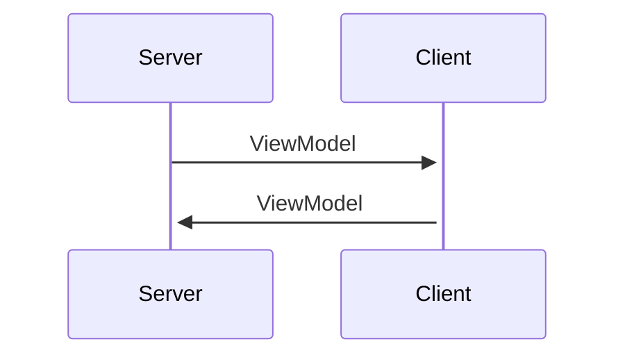

# MVVM Directory Structure

ここではMVVMを実現させる為のディレクトリ構成を解説する。

# ディレクトリ構成

- Server
  - Models : Modelを格納する
- Shared
  - ViewModels : ViweModelを格納する
- Client
  - ViewModelFacotries : ViewModelFactoryを格納する

# なぜこの構成なのか

1. ServerとClientをきれいに分けたい

記述を簡単にする、かつ管理を楽にするために、Client側とServer側をきれいに別れるようにしたい。

2. ViewModelを橋渡しにしたい

ViewModelをClient側とServer側のデータのやり取りの橋渡しにしたい。

Sharedに格納することで、どちら側からも見えるようにする